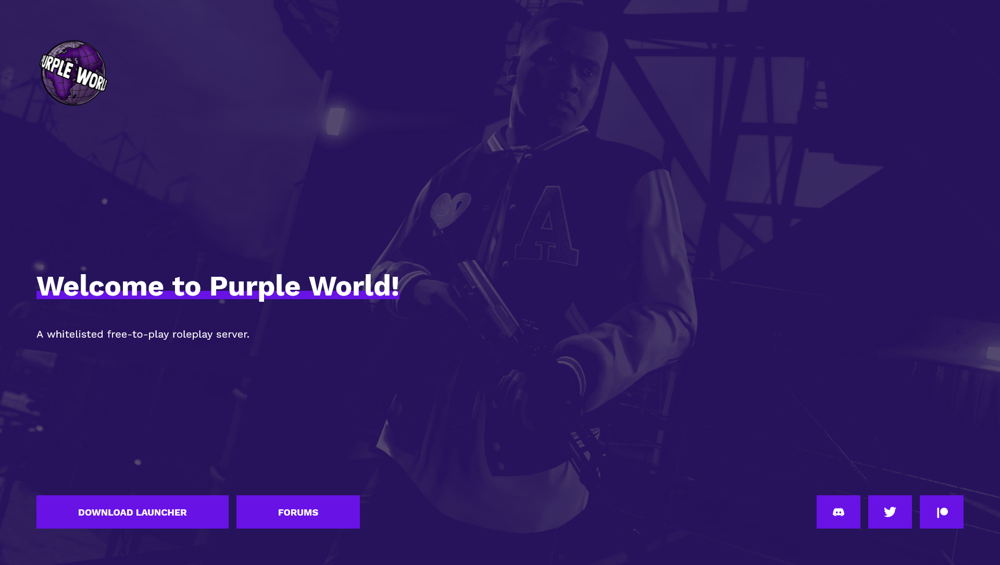

<p align="center">
  <a href="https://play.purpleworld.net" target="_blank"></a>
</p>
<p align="center">
  A Grand Theft Auto V community roleplay server landing page built with <a href="https://www.gatsbyjs.org/" target="_blank">Gatsby</a> and hosted on <a href="https://pages.github.com/" target="_blank">GitHub Pages</a>
</p>


## Preview




## Installation & set up

1. Install Gatsby CLI:
    ```
    npm install -g gatsby-cli
    ```

2. Clone the repository:
   ```
   git clone git@github.com:purple-world/purple-world.github.io.git
   ```

3. Navigate to the project folder and install dependencies:
   ```sh
   cd purple-world
   npm install
   ```

4. Start the development server:

   ```sh
   gatsby develop
   ```

## Building and running in production

1. Generate a full static production build:

   ```sh
   gatsby build
   ```

2. Preview the site as it will appear once deployed:

   ```sh
   gatsby serve
   ```

## Content editing

- Content displayed on page such as texts and buttons can be modified through YAML files located in `/src/config/` subfolders.

## Deployment

1. Run the deployment script:
    ```
    npm run deploy
    ```
    Warning: *This pushes directly to remote master branch and triggers GitHub Pages rebuild hook!*
